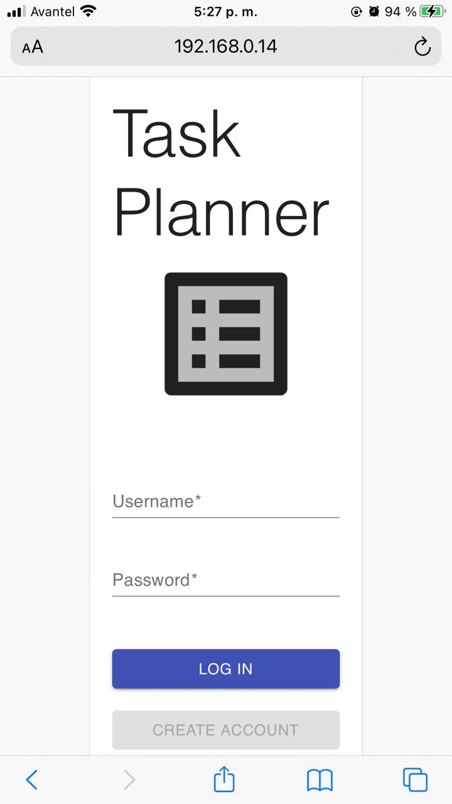

# Lab # 3 - IETI
# 1.2 Task Planner Project - Front End

[](https://frasica-ieti-lab3.herokuapp.com/)

[](https://lab3-ieti.web.app/)


### Pre-requisitos 📋

* NodeJS
* Git


### Instalación 🔧

1. Clonar el repositorio

```
git clone https://github.com/sebastianfrasic/IETI-Lab3.git
```


2. Para ejecutar la aplicación

```
npm install
```


```
npm start
```

### Vista del Login desde un celular



3. Para el login las credenciales son las siguientes:

**Username:** sebastian
**Password:** 12345


## Construido con 🛠️

* React


## Autor ✒️

* Juan Sebastián Frásica Galeano

## Licencia 📄

Este proyecto está bajo la Licencia GNU General Public License - [LICENSE](LICENSE) 
